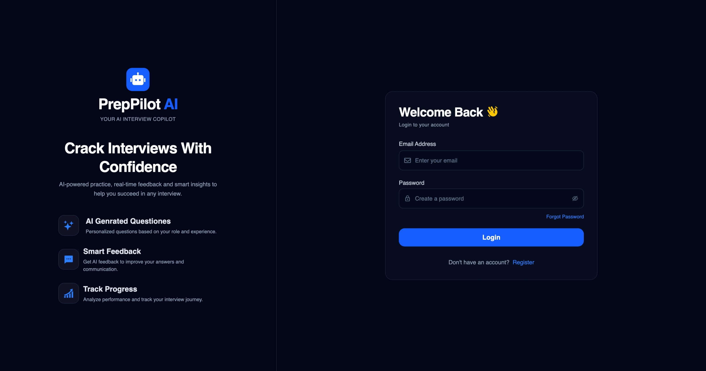
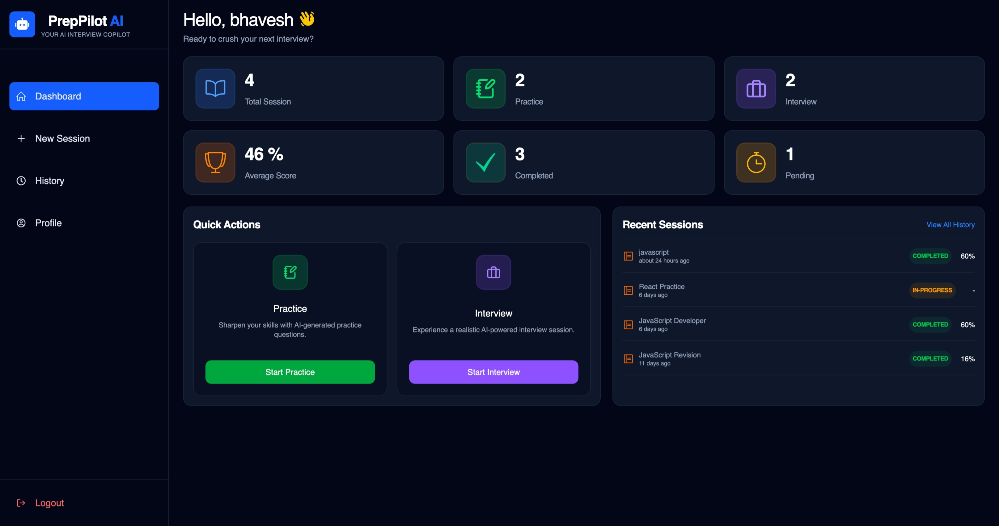
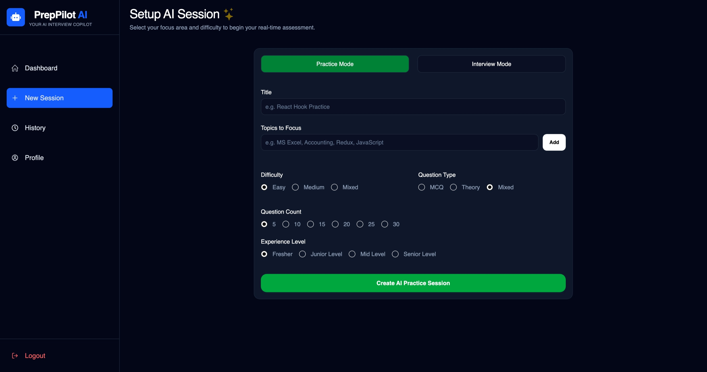
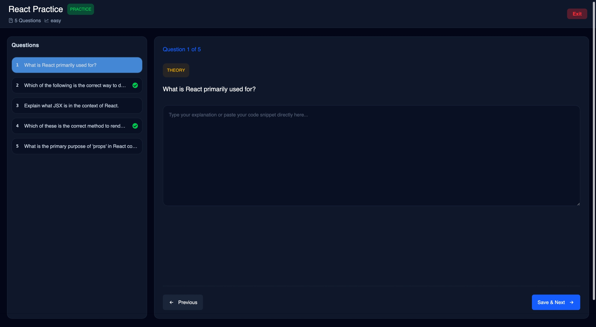
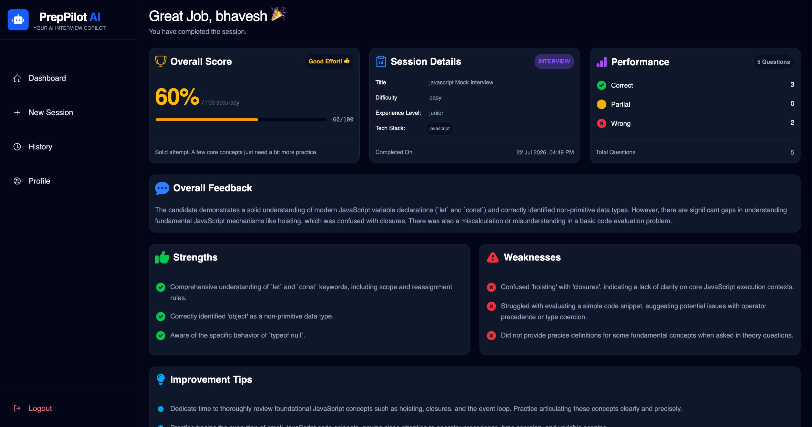
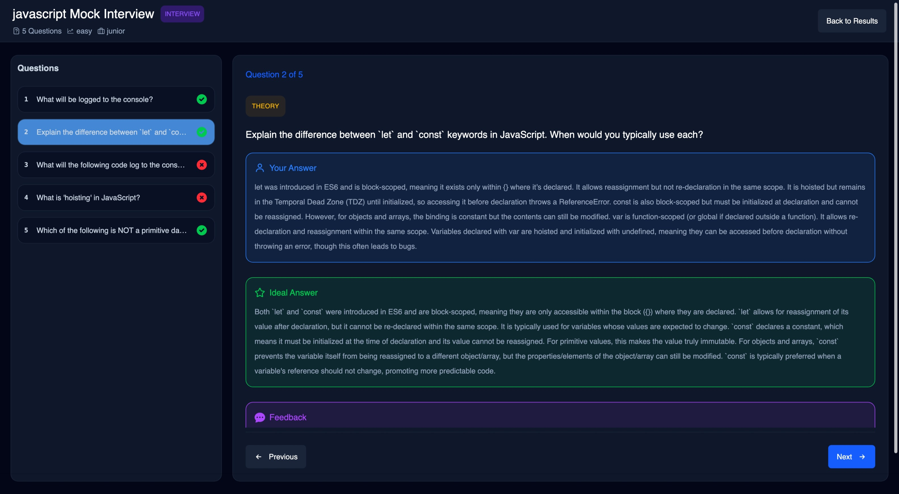
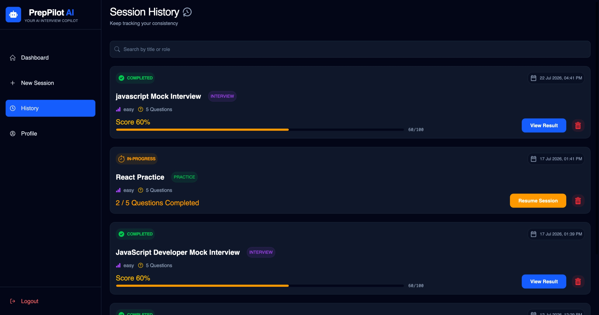

# 🚀 PrepPilot AI

An AI-powered interview preparation platform that helps users practice technical interviews with personalized AI-generated questions, receive instant feedback, and track their performance over time.

Built using the MERN Stack with Google Gemini AI integration.

---

## 🌐 Live Demo

- **Frontend:** https://prep-pilot-ai-alpha.vercel.app/
- **Backend:** https://prep-pilot-ai-1ae5.onrender.com

---

## ✨ Features

### 👤 Authentication

- User Registration & Login
- Secure JWT Authentication using HTTP-only Cookies
- Forgot Password via Email
- Reset Password
- Change Password
- Protected Routes

### 🤖 AI Practice Sessions

- Practice Mode
- Interview Mode
- AI-generated Questions using Google Gemini
- MCQ, Theory & Mixed Question Types
- Multiple Difficulty Levels
- Custom Topics / Tech Stack Selection
- Configurable Question Count

### 📊 Dashboard

- Session Statistics
- Quick Actions
- Practice & Interview History
- Performance Tracking

### 📝 Session Features

- Real-time Question Navigation
- Save Answers
- Review Answers
- AI Evaluation
- Session Result & Feedback

### 👨‍💼 Admin Panel

- Dashboard Analytics
- Manage Users
- Manage Sessions
- Delete Users
- Delete Sessions
- Search & Pagination

### 🎨 UI

- Responsive Design
- Mobile Friendly
- Dark Theme
- Loading Screens
- Custom 404 Page

---

## 🛠 Tech Stack

### Frontend

- React.js
- Vite
- Tailwind CSS
- React Router DOM
- React Hook Form
- Zod
- Axios
- Shadcn UI

### Backend

- Node.js
- Express.js
- MongoDB
- Mongoose
- JWT Authentication
- bcrypt
- Nodemailer
- Google Gemini AI

### Deployment

- Vercel (Frontend)
- Render (Backend)

---

## 📸 Screenshots

### 🔐 Login



### 📊 Dashboard



### 🤖 New Session



### 💻 Session Room



### 📈 Result



### 📝 Review Answers



### 📚 History



Example:

- Login Page
- Dashboard
- New Session
- Practice Session
- Interview Session
- Session Result
- Admin Dashboard

---

## ⚙️ Installation

### Clone Repository

```bash
git clone https://github.com/bkumbhare11/prep-pilot-ai.git
```

### Install Dependencies

#### Client

```bash
cd client
npm install
npm run dev
```

#### Server

```bash
cd server
npm install
npm run dev
```

---

## 🔑 Environment Variables

### Server (.env)

```env
PORT=
MONGO_URI=

JWT_SECRET=
JWT_EXPIRES_IN=

GEMINI_API_KEY=
GEMINI_MODEL=

EMAIL_USER=
EMAIL_PASS=

FRONTEND_URL=
CLIENT_URL=

NODE_ENV=
```

### Client (.env)

```env
VITE_API_URL=
```

---

## 📂 Folder Structure

```
prep-pilot-ai
│
├── client
│   ├── src
│   ├── public
│   └── package.json
│
├── server
│   ├── controllers
│   ├── models
│   ├── routes
│   ├── middleware
│   ├── services
│   ├── utils
│   └── package.json
│
└── README.md
```

---

## 🔮 Future Improvements

- AI Voice Interview
- Resume-based Question Generation
- Detailed Performance Analytics

---

## 👨‍💻 Author

**Bhavesh Kumbhare**

- GitHub: https://github.com/bkumbhare11
- LinkedIn: https://www.linkedin.com/in/bhavesh-kumbhare-552a4a2b0

---

⭐ If you found this project useful, consider giving it a star on GitHub.
